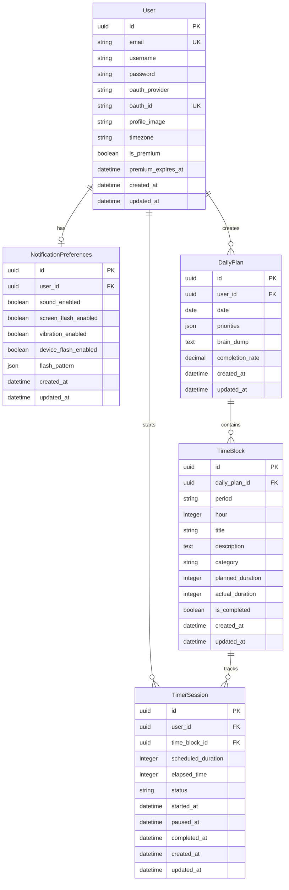

# TIME BLOCK Database ERD

**작성일:** 2025-12-20
**DBMS:** PostgreSQL 14+
**ORM:** Django 5.0

---

## ERD Diagram (Mermaid)



---

## 📋 Table Definitions

### 1. User (사용자)

**목적:** 회원 정보 및 OAuth 인증 관리

| Column | Type | Constraints | Description |
|--------|------|-------------|-------------|
| `id` | UUID | PRIMARY KEY | 사용자 고유 ID |
| `email` | VARCHAR(255) | UNIQUE, NOT NULL | 이메일 (로그인 ID) |
| `username` | VARCHAR(100) | NOT NULL | 사용자 이름 |
| `password` | VARCHAR(255) | NULL | 비밀번호 해시 (OAuth 전용 유저는 NULL) |
| `oauth_provider` | VARCHAR(20) | NULL | OAuth 제공자 (google, kakao) |
| `oauth_id` | VARCHAR(255) | NULL | OAuth 고유 ID |
| `profile_image` | VARCHAR(500) | NULL | 프로필 이미지 URL |
| `timezone` | VARCHAR(50) | DEFAULT 'Asia/Seoul' | 사용자 타임존 |
| `is_premium` | BOOLEAN | DEFAULT FALSE | 프리미엄 회원 여부 |
| `premium_expires_at` | TIMESTAMP | NULL | 프리미엄 만료일 |
| `created_at` | TIMESTAMP | DEFAULT NOW() | 생성일시 |
| `updated_at` | TIMESTAMP | DEFAULT NOW() | 수정일시 |

**Indexes:**
```sql
CREATE UNIQUE INDEX idx_user_email ON user(email);
CREATE UNIQUE INDEX idx_user_oauth ON user(oauth_provider, oauth_id) WHERE oauth_provider IS NOT NULL;
CREATE INDEX idx_user_premium ON user(is_premium, premium_expires_at);
```

**Constraints:**
- `email` MUST be valid email format
- `oauth_provider` ENUM: ['google', 'kakao', NULL]
- `password` NULL only if `oauth_provider` IS NOT NULL

---

### 2. NotificationPreferences (알림 설정)

**목적:** 사용자별 무음 알림 설정

| Column | Type | Constraints | Description |
|--------|------|-------------|-------------|
| `id` | UUID | PRIMARY KEY | 설정 고유 ID |
| `user_id` | UUID | FK → User, UNIQUE | 사용자 ID (1:1) |
| `sound_enabled` | BOOLEAN | DEFAULT FALSE | 소리 알림 |
| `screen_flash_enabled` | BOOLEAN | DEFAULT TRUE | 화면 플래시 |
| `vibration_enabled` | BOOLEAN | DEFAULT TRUE | 진동 알림 |
| `device_flash_enabled` | BOOLEAN | DEFAULT FALSE | 카메라 플래시 (Premium) |
| `flash_pattern` | JSONB | DEFAULT '{}' | 플래시 패턴 커스텀 |
| `created_at` | TIMESTAMP | DEFAULT NOW() | 생성일시 |
| `updated_at` | TIMESTAMP | DEFAULT NOW() | 수정일시 |

**Indexes:**
```sql
CREATE UNIQUE INDEX idx_notification_user ON notification_preferences(user_id);
```

**flash_pattern JSON Structure:**
```json
{
  "duration": 500,
  "count": 3,
  "interval": 200,
  "color": "#10b981"
}
```

---

### 3. DailyPlan (일일 계획)

**목적:** 날짜별 다이어리 및 우선순위 관리

| Column | Type | Constraints | Description |
|--------|------|-------------|-------------|
| `id` | UUID | PRIMARY KEY | 계획 고유 ID |
| `user_id` | UUID | FK → User, NOT NULL | 사용자 ID |
| `date` | DATE | NOT NULL | 계획 날짜 |
| `priorities` | JSONB | DEFAULT '[]' | 우선순위 3개 (배열) |
| `brain_dump` | TEXT | NULL | Brain Dump 자유 메모 |
| `completion_rate` | DECIMAL(5,2) | DEFAULT 0.00 | 완료율 (0-100%) |
| `created_at` | TIMESTAMP | DEFAULT NOW() | 생성일시 |
| `updated_at` | TIMESTAMP | DEFAULT NOW() | 수정일시 |

**Indexes:**
```sql
CREATE UNIQUE INDEX idx_daily_plan_user_date ON daily_plan(user_id, date);
CREATE INDEX idx_daily_plan_date ON daily_plan(date);
```

**Constraints:**
- UNIQUE(`user_id`, `date`) - 하루에 1개 계획만 가능
- `completion_rate` BETWEEN 0 AND 100

**priorities JSON Structure:**
```json
[
  "논문 읽기 3편 완료",
  "알고리즘 문제 5개 풀기",
  "운동 1시간"
]
```

---

### 4. TimeBlock (시간 블록)

**목적:** 시간대별 계획 블록 (4AM-12PM, 1PM-12AM)

| Column | Type | Constraints | Description |
|--------|------|-------------|-------------|
| `id` | UUID | PRIMARY KEY | 블록 고유 ID |
| `daily_plan_id` | UUID | FK → DailyPlan, NOT NULL | 일일 계획 ID |
| `period` | VARCHAR(2) | NOT NULL | 시간대 (am/pm) |
| `hour` | INTEGER | NOT NULL | 시간 (1-12) |
| `title` | VARCHAR(200) | NULL | 블록 제목 |
| `description` | TEXT | NULL | 상세 설명 |
| `category` | VARCHAR(50) | NULL | 카테고리 (study, work, rest 등) |
| `planned_duration` | INTEGER | DEFAULT 60 | 계획 시간 (분) |
| `actual_duration` | INTEGER | DEFAULT 0 | 실제 시간 (분) |
| `is_completed` | BOOLEAN | DEFAULT FALSE | 완료 여부 |
| `created_at` | TIMESTAMP | DEFAULT NOW() | 생성일시 |
| `updated_at` | TIMESTAMP | DEFAULT NOW() | 수정일시 |

**Indexes:**
```sql
CREATE UNIQUE INDEX idx_timeblock_plan_time ON time_block(daily_plan_id, period, hour);
CREATE INDEX idx_timeblock_category ON time_block(category);
CREATE INDEX idx_timeblock_completed ON time_block(is_completed);
```

**Constraints:**
- UNIQUE(`daily_plan_id`, `period`, `hour`) - 한 시간대에 1개 블록
- `period` ENUM: ['am', 'pm']
- `hour` BETWEEN 1 AND 12
- `planned_duration` > 0
- `actual_duration` >= 0

---

### 5. TimerSession (타이머 세션)

**목적:** 타이머 실행 기록 및 집중 시간 추적

| Column | Type | Constraints | Description |
|--------|------|-------------|-------------|
| `id` | UUID | PRIMARY KEY | 세션 고유 ID |
| `user_id` | UUID | FK → User, NOT NULL | 사용자 ID |
| `time_block_id` | UUID | FK → TimeBlock, NULL | 연결된 시간 블록 (선택적) |
| `scheduled_duration` | INTEGER | NOT NULL | 설정 시간 (초) |
| `elapsed_time` | INTEGER | DEFAULT 0 | 경과 시간 (초) |
| `status` | VARCHAR(20) | NOT NULL | 상태 |
| `started_at` | TIMESTAMP | NOT NULL | 시작 시각 |
| `paused_at` | TIMESTAMP | NULL | 일시정지 시각 |
| `completed_at` | TIMESTAMP | NULL | 완료 시각 |
| `created_at` | TIMESTAMP | DEFAULT NOW() | 생성일시 |
| `updated_at` | TIMESTAMP | DEFAULT NOW() | 수정일시 |

**Indexes:**
```sql
CREATE INDEX idx_timer_user_date ON timer_session(user_id, DATE(started_at));
CREATE INDEX idx_timer_block ON timer_session(time_block_id);
CREATE INDEX idx_timer_status ON timer_session(status);
CREATE INDEX idx_timer_completed ON timer_session(completed_at);
```

**Constraints:**
- `status` ENUM: ['running', 'paused', 'completed', 'cancelled']
- `scheduled_duration` > 0
- `elapsed_time` >= 0 AND `elapsed_time` <= `scheduled_duration`

---

## 🔗 Relationships

### One-to-One (1:1)
```
User ←→ NotificationPreferences
- User 삭제 시 NotificationPreferences도 CASCADE 삭제
```

### One-to-Many (1:N)
```
User → DailyPlan (1:N)
- User 삭제 시 모든 DailyPlan CASCADE 삭제

DailyPlan → TimeBlock (1:N)
- DailyPlan 삭제 시 모든 TimeBlock CASCADE 삭제

User → TimerSession (1:N)
- User 삭제 시 모든 TimerSession CASCADE 삭제

TimeBlock → TimerSession (1:N, Optional)
- TimeBlock 삭제 시 time_block_id를 NULL로 SET NULL
```

---

## 📊 Data Flow Example

### 사용자 하루 워크플로우

```
1. 사용자 로그인 (OAuth)
   → User 테이블 조회/생성

2. 오늘 날짜 DailyPlan 조회
   → SELECT * FROM daily_plan WHERE user_id = ? AND date = '2025-12-20'

3. 우선순위 3개 작성 (Auto-save)
   → UPDATE daily_plan SET priorities = [...], updated_at = NOW()

4. 6 AM 블록에 "논문 읽기" 계획
   → INSERT INTO time_block (daily_plan_id, period='am', hour=6, title='논문 읽기')

5. 30분 타이머 시작
   → INSERT INTO timer_session (user_id, time_block_id, scheduled_duration=1800, status='running')

6. 타이머 완료
   → UPDATE timer_session SET status='completed', elapsed_time=1800, completed_at=NOW()
   → UPDATE time_block SET actual_duration = actual_duration + 30, is_completed = TRUE

7. 통계 조회
   → SELECT SUM(elapsed_time) FROM timer_session WHERE user_id = ? AND DATE(started_at) = '2025-12-20'
```

---

## 🔍 Important Queries

### 1. 오늘의 집중 시간 (Daily Focus Time)
```sql
SELECT
  COALESCE(SUM(elapsed_time) / 60, 0) AS total_focus_minutes
FROM timer_session
WHERE user_id = :user_id
  AND DATE(started_at) = :date
  AND status = 'completed';
```

### 2. 오늘의 완료 블록 수 (Completed Blocks)
```sql
SELECT COUNT(*) AS completed_blocks
FROM time_block tb
JOIN daily_plan dp ON tb.daily_plan_id = dp.id
WHERE dp.user_id = :user_id
  AND dp.date = :date
  AND tb.is_completed = TRUE;
```

### 3. 실행률 계산 (Execution Rate)
```sql
SELECT
  CASE
    WHEN SUM(planned_duration) = 0 THEN 0
    ELSE (SUM(actual_duration)::DECIMAL / SUM(planned_duration)) * 100
  END AS execution_rate
FROM time_block tb
JOIN daily_plan dp ON tb.daily_plan_id = dp.id
WHERE dp.user_id = :user_id
  AND dp.date = :date;
```

### 4. 히트맵 데이터 (연간 집중 시간)
```sql
SELECT
  DATE(started_at) AS date,
  SUM(elapsed_time) / 60 AS focus_minutes
FROM timer_session
WHERE user_id = :user_id
  AND EXTRACT(YEAR FROM started_at) = :year
  AND status = 'completed'
GROUP BY DATE(started_at)
ORDER BY date;
```

### 5. 주간 통계 (Weekly Stats)
```sql
SELECT
  DATE(started_at) AS date,
  COUNT(*) AS session_count,
  SUM(elapsed_time) / 60 AS total_minutes,
  AVG(elapsed_time) / 60 AS avg_minutes
FROM timer_session
WHERE user_id = :user_id
  AND started_at >= :start_date
  AND started_at < :end_date
  AND status = 'completed'
GROUP BY DATE(started_at)
ORDER BY date;
```

---

## 🚀 Migration Strategy

### Phase 1: Initial Schema
```bash
# Create tables in order
1. users
2. notification_preferences
3. daily_plans
4. time_blocks
5. timer_sessions
```

### Phase 2: Add Indexes
```bash
# Create indexes after data insertion for performance
# Already defined in table definitions
```

### Phase 3: Add Constraints
```bash
# Foreign keys
# Check constraints
# Unique constraints
```

---

## 🔒 Security Considerations

### 1. Row-Level Security (RLS)
```sql
-- 사용자는 자신의 데이터만 조회/수정 가능
ALTER TABLE daily_plan ENABLE ROW LEVEL SECURITY;

CREATE POLICY user_daily_plan_policy ON daily_plan
  USING (user_id = current_user_id());
```

### 2. Soft Delete (선택적)
```sql
-- 데이터 복구를 위한 soft delete
ALTER TABLE timer_session ADD COLUMN deleted_at TIMESTAMP NULL;
CREATE INDEX idx_timer_deleted ON timer_session(deleted_at) WHERE deleted_at IS NULL;
```

### 3. Audit Log (선택적)
```sql
-- 중요 테이블에 트리거로 audit log 기록
CREATE TABLE audit_log (
  id UUID PRIMARY KEY,
  table_name VARCHAR(50),
  record_id UUID,
  action VARCHAR(20),
  old_data JSONB,
  new_data JSONB,
  user_id UUID,
  created_at TIMESTAMP DEFAULT NOW()
);
```

---

## 📈 Performance Optimization

### 1. Partitioning (향후 고려)
```sql
-- timer_session을 날짜 기준으로 파티셔닝
-- 100만 rows 이상 시 고려
CREATE TABLE timer_session (
  ...
) PARTITION BY RANGE (started_at);
```

### 2. Materialized View (통계 캐싱)
```sql
-- 주간/월간 통계를 미리 계산
CREATE MATERIALIZED VIEW weekly_stats AS
SELECT
  user_id,
  DATE_TRUNC('week', started_at) AS week_start,
  SUM(elapsed_time) / 60 AS total_minutes,
  COUNT(*) AS session_count
FROM timer_session
WHERE status = 'completed'
GROUP BY user_id, DATE_TRUNC('week', started_at);

-- 매일 새벽 2시에 REFRESH
CREATE INDEX idx_weekly_stats_user ON weekly_stats(user_id, week_start);
```

### 3. Connection Pooling
```python
# Django settings.py
DATABASES = {
    'default': {
        'ENGINE': 'django.db.backends.postgresql',
        'CONN_MAX_AGE': 600,  # 10 minutes
        'OPTIONS': {
            'connect_timeout': 10,
            'options': '-c statement_timeout=30000'  # 30 seconds
        }
    }
}
```

---

## 📝 Notes

### Auto-increment vs UUID
- ✅ UUID 사용 (분산 시스템, 보안, URL 노출 방지)
- ❌ Auto-increment는 성능 우위 있지만 보안 취약

### JSONB vs Normalized Tables
- `priorities`: JSONB (고정 3개, 빈번한 조회 없음)
- `flash_pattern`: JSONB (사용자별 커스텀, 구조 유연)
- `categories`: 향후 별도 테이블로 정규화 고려

### Timestamp vs Date
- `DailyPlan.date`: DATE (날짜만 필요)
- `TimerSession.started_at`: TIMESTAMP (초 단위 기록 필요)

### Cascade vs Set Null
- User → DailyPlan: CASCADE (사용자 삭제 시 모든 데이터 삭제)
- TimeBlock → TimerSession: SET NULL (블록 삭제해도 세션 기록 유지)

---

**ERD 버전:** 1.0
**마지막 업데이트:** 2025-12-20
**다음 단계:** Django Models 구현 ([app/users/models.py](app/users/models.py), [app/plans/models.py](app/plans/models.py), [app/timers/models.py](app/timers/models.py))
